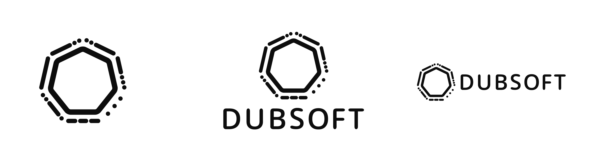
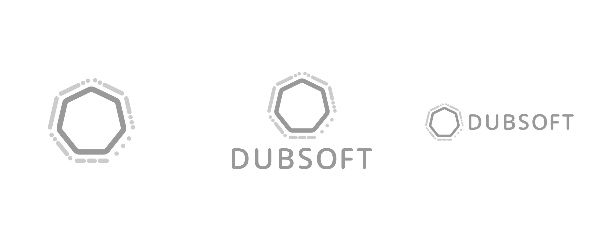

# Dubsoft Logo Assets
This file goes over the various ways to use the different logo assets, typography, and color for the Dubsoft brand (including links to all the various assets). As a living style guide, if things change for the brand they should be updated here as well so that this document is always a guide to the brand as it currently exists.

1. [Logo]()
  - [Lock-ups]()
  - [Black and White]()
  - [Grayscale]()
  - [Color]()
  - [Animated]()
  - [Dos and Don'ts]()

2. [Typography]()
  - [Headings]()
  - [Paragraphs]()
  - [Examples of Pairings]()

3. [Photography]()
  - [Dos and Don'ts]()

4. [Site Design Assets]()

## Logo
### Lock-Ups

There are three lockups for the Dubsoft brand: the logo by itself, a vertical lockup, and a horizontal lockup. As only more mature brands are able to successfully use their logos by themselves (as a lot to do with marketing and name-recognition) it's recommended that the logo by itself only be used when there are other references to the company accompanying it (for example, the logo on one side of the business card, and the full logo or logotype on the other).

## Black and White

**Black and White Logo:** [EPS](logo/black-and-white/eps/logo-b-w.eps), [JPEG](logo/black-and-white/jpeg/logo-b-w.jpg) (white background), [PNG](logo/black-and-white/png/logo-b-w.png), [SVG](logo/black-and-white/png/logo-b-w.png)

**Black and White Logo, vertical lockup:** [EPS](logo/black-and-white/eps/logo-b-w-vertical.eps), [JPEG](logo/black-and-white/jpeg/logo-b-w-vertical.jpg) (white background), [PNG](logo/black-and-white/png/logo-b-w-vertical.png), [SVG](logo/black-and-white/svg/logo-b-w-vertical.svg)

**Black and White Logo, horizontal lockup:** [EPS](logo/black-and-white/eps/logo-b-w-horizontal.eps), [JPEG](logo/black-and-white/eps/logo-b-w-horizontal.jpg) (white background), [PNG](logo/black-and-white/png/logo-b-w-horizontal.png), [SVG](logo/black-and-white/svg/logo-b-w-horizontal.svg)

I recommend the black and white logo for places where you're uncertain of contrast coming out well/you don't have control over the print process.

## Grayscale
For instances where you have control over the printing process/need to use a black and white version of the logo and don't want the unitone version, there's a grayscale version as well:

**Grayscale Logo:** [EPS](), [JPEG](), [PNG](), [SVG](),

**Grayscale Logo, vertical lockup:** [EPS](), [JPEG](), [PNG](), [SVG]()

**Grayscale Logo, horizontal lockup:** [EPS](), [JPEG](), [PNG](), [SVG]()

## Color

## Animated

## Dos and Don'ts
stretching, coloration, whitespace, skewing, pixelation